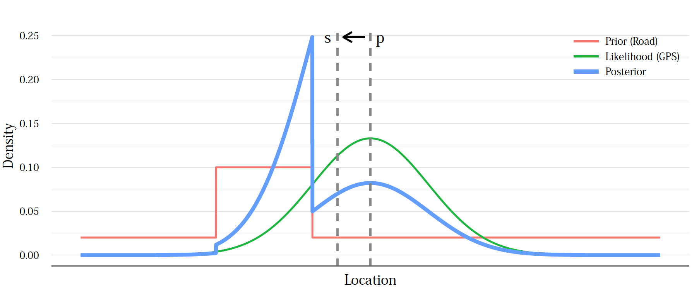

Data UnCertainty - DUC Project
------------------------------

**[TODO]: Intro**

# Background

## Probability density function (PDF)

> In probability theory, a probability density function (PDF), or density of a continuous random variable, is a function, whose value at any given sample (or point) in the sample space (the set of possible values taken by the random variable) can be interpreted as providing a relative likelihood that the value of the random variable would equal that sample. [3]

*Example of a PDF:* A Guassian function where

*Example:* Let x a random variable defines over probability space O. If x is discrete, then O will contain all possible values. However, it will be equal to the domain of the variable, like the set of natural numbers or the set of real numbers.  If we denote p as a PDF, p(y) represents the probabiliy that the variable x takes y as value.

## Bayesian inference

> Bayesian inference is a method of statistical inference in which Bayes' theorem is used to update the probability for a hypothesis as more evidence or information becomes available. [4]

Bayes'theorem allow to combine two proabilistic distribution when the variables are dependent.

P(H|E) = [ P(E | H) . P(H)  ] / P(E)

where

- | means "event conditional on" (H|E means H given E)
- H stands for any hypothesis whose probability may be affected by data, referred to as evidence
- P(H), is named the prior probability, is the estimate of the hypothesis H before data E, the evidence, is observed
- the evidence E corresponds to new data that were not used in computing the prior probability
- P(H|E), is named the posterior probability, is the probability of H given E, i.e., after E is observed
- P(E|H), is named the likelihood, is the probability of observing E given H
- P(E) is sometimes termed the marginal likelihood or model evidence

Example from [1]

# How uncertainty evaluation is done?

## Comparing values with other data

### Consistency check

### Redundancy check

## Comparing processing and measuring time (data freshness)

## Data source

Techniques to give reliability evaluation of sources + propagate the impact of it to UC representation

## Propagating uncertainty

## Comparing values with past ones

### Using Bayesian inference
In the next section, we describe how to use the Bayes' theorem to incorporate domain knowledge. This domain knowledge, can be past values.

From past measurements, we can compute a probabilistic distribution model like did by Hartmann et al. [2]

Here the goal is to compute P(H|E) where:

- P(H) is the distribution representing the past values
- P(E|H) is the computed distribution of the measurement
- P(E) is ???

## Comparing values with domain knowledge

### Using Bayesian inference
Example: uncetainty distribution for GPS sensor [1]

Here the goal is to compute P(H|E) where:

- P(H) is the distribution representing the domain knowledge
- P(E|H) is the computed distribution of the measurement
- P(E) is ???

In this example, they use domain knowledge to define the initial probability distribution of the GPS location.
For example, it is more likely that the user will be on the road than on the sea.

## Using a theoretical distribution function

Example: uncetainty distribution for GPS sensor [1]

Due to techniques used to approximate GPS location, GPS sensors give a position with a certain precision, generally in meters.
It exists some theortical models to represent GPS data uncertainty distribution.

However: it considers that the distribution won't evolve through time. For example,  Bornholt [1] considers that the uncertainty is always small. Means, that the used approach do not manage sensors that gives completly wrong values.

IDEA here: compute a prior distribution based on domain knowledge + past values then add measured value and see

# How to represent the uncertainty?

## A range

## A value

## A function (probability distribution function)
- if time is important

Uc(value) -> value
Uc(time, value) -> value

Distribution function

- Probability density function
    - Multivariant
    - univariant
    - e.g., Gaussion function

# Conclusion: what the solution should do?

- Help the evaluation
- Represent (store + define a way to access)

# References

- [1]: Bornholt, J. (2013). "Abstractions and techniques for programming with uncertain data", (Doctoral dissertation, Honors thesis, Australian National University).
- [2]: Hartmann, T., Moawad, A., Fouquet, F., Reckinger, Y., Mouelhi, T., Klein, J., & Le Traon, Y. (2015, November). Suspicious electric consumption detection based on multi-profiling using live machine learning. In Smart Grid Communications (SmartGridComm), 2015 IEEE International Conference on (pp. 891-896). IEEE.
- [3]: https://en.wikipedia.org/wiki/Probability_density_function
- [4]: https://en.wikipedia.org/wiki/Bayesian_inference