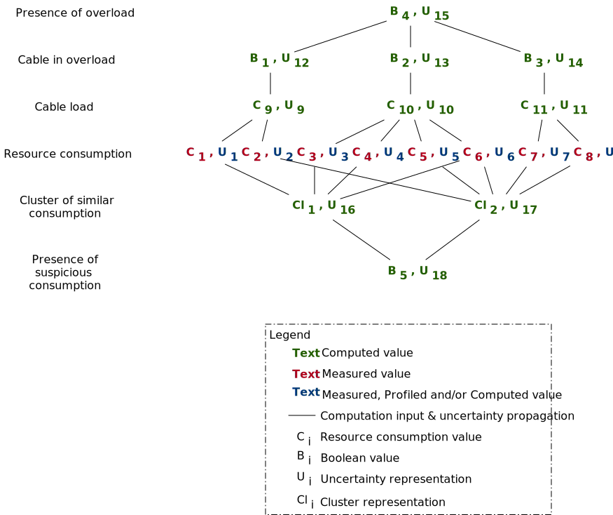

# Sandbox for uncertainty modeling

<!-- uncertainty —> noise dans le ML   ——> apprentissage du “cahos” —> predicted model == bad

How to detect this uncerrtainty from data?
Currently manual filtering based on:
    - known domain knowledge
        - are data consistent with my domain?
            - e.g, haut fournaux:
                - data filtered because not consistent with another one
                - data removed because "usine" was closed
                - data removed because sensor behaviorr deviates and start to be untrusted
                    - eg., data are less and less regular / certain
    - used values / grand truth about the usual values of the data
        - is value consistent with previous records? -->

## Story

- models@run.time paradigm [Blair et al. 2009, Morin et al., 2009] is a MDE approach used to abstract, manipulate and, reason about system contexts
    - e.g., adaptive systems
- One important characteristic of system contexts is the uncertainty of measured or computed information [Ramirez et al., 2012a; De Lemos et al., 2013; Henricksen et al., 2002; Makris et al., 2013; Bettini et al., 2010]
    - uncertainty of measured data
    - uncertainty of computed data from measured ones

- We argue that this uncertainty should be abstract: some model elements should conform to uncertainty concepts
    - to ease the development of reasoning processes
    - to improve the outcome of reasoning processes
- However, current MDE approaches lack of techniques* for data uncertainty abstraction
    - some studies focus on the design uncertainty [Famelis et al., 2017; Famelis et al., 2012; Famelis et al., 2013; Famelis et al., 2015; Famelis et al., 2013; Rosa 2015; Eramo et al., 2014; Eramo et al., 2015; Eramo et al., 2016; Brambilla et al., 2017, Lagarde et al., 2007]
    - one study about what uncertainty is [Zhang et al., 2016]
    - a few studies about how to tackle environmental uncertainty [Goldsby et al., 2008; Cheng, B., et al., 2009; Ramirez et al., 2012a; Cailliau et al., 2017; Murugesan et al., 2014]
    - a few studies about how to tackle model evaluation uncertainty [Meedeniya et al., 2014]
    - primary studies that abstract data uncertainty
        - [Mayerhofer et al., 2016]: first step in uncertainty management, they abstract measure precisions and show how to combine them
    - a few studies about data uncertainty [Yang, W. et al., 2014]
- To tackle this problem, we propose to abstract uncertainty management techniques at the EMOF level
    - uncertainty as a built-in concept
- Validation by implementing reasoning tasks that manipulates the uncertainty of data and compare the outcome without

**Quote that we can use to reinforce our argumentation**

- "Most programming languages force developers to reason about uncertain data with discrete types (float, integers, and booleans). Motivated application developers reason about uncertainty in ad hoc ways, but because this task is complex, many more simply ignore uncertainty", Bornholt et al., 2014

## Uncertainty definition

### DAS Systems
**Source:**  Ramirez et al., 2012b
> Uncertainty is a system state of incomplete or inconsistent knowledge such that it is not possible for a DAS to know which of two or more alternative environment or system configurations hold at a specific point. This uncertainty can occur due to missing or ambiguous requirements, false assumptions, unpredictable entities or phenomena in the execution environment, and unresolvable conditions caused by **incomplete and inconsistent information obtained by potentially imprecise, inaccurate, and unreliable sensors in its monitoring infrastructure**.

| Term | Definition |
|-|-|
| Effector | An adaptation that alters the execution environment in unanticipated ways |
| Sensor failure | When a sensor cannot measure or report the value of a property |
| Sensor noise | Random and persistent disturbances that reduce the clarity of a signal |
| Imprecision | A lack of repeatability in a given measurement |
| Inaccuracy | A divergence between a measured value and its real value |
| Unpredictable Environment | Events and conditions in the environment that cannot be anticipated |
| Ambiguity | A lack of numerical precision and accuracy in a measurement |
| Non-Specificity | A property whose value is only known within a certain range of values |
| Inconsistency | Two or more values of the same property that disagree with each other |
| Incomplete Information | A missing or unknown dimension of data |

### Data integration

**Source:** Magnani et al., 2010
> Uncertainty is a state of limited knowledge, where we do not know which of two or more alternative statements is true.

| Term | Example (John's tallness) |
|-|-|
| No imperfection | 183 cm |
| Absence/missing values | Not known |
| Non-Specificity | Between 180 and 190 cm / 183 or 184 or 185 cm |
| Vagueness | Not very tall |
| Uncertainty | Perhaps, 183 cm |
| Inconsistency | 183 and 184 and 185 cm |
| Error | 170 cm|

### Databases

**Source:** Othman et al., 2015
> Uncertainty exists when knowledge of the real world cannot be indicated with absolute confidence. Uncertainty might result from using unreliable information source, as faulty reading instrument or input forms that have been filled out incorrectly, or it can be a result of system errors, such as transmission errors and noise, delay in processing update transactions, and imperfections of software.

| Term | Definition |
|-|-|
| Uncertainty | Data objects that cannot be assured with an obsolete confidence |
| Vagueness | Data item that belongs to a range of values without a clear determination of its exact value |
| Ambiguity | Incomplete description of a data item |
| Imprecision | Not precise data |
| Inconsistency | Conflicting data |

### Programming language

**Source:** Bornholt et al., 2014
> Application that sense and reason about the complexity of the world use estimates. [...] The difference between an estimate and its true value is uncertainty.

### IEEE Standard

**Source:** IEEE, 2017
> 1. Result of not having accurate or sufficient knowledge of a situation. 2. State, even partial, of deficiency of information related to understanding or knowledge af an event, its consequence, or likelihood

### Context modeling

**Source:** Makris et al., 2013
> [...] [U]ncertain context information exists when: a) there is no clear knowledge of something (imperfection), b) it is difficult to distinguish an option among some seemingly correct alternatives (ambiguity), c) there is a mismatch between the actual and the reported states of information (wrong context), and d) no information is available at specific time instances (unknown).

| Term | Definition |
|-|-|
| Imperfect | Imperfect context is informtion or knowledge, which is basically correct but it has some shortcomings that are usually manageable by the system[...][:] inaccuracy, incompleteness and out-of-dateness.
| Ambiguous | Ambiguous context is information or knowledge, which exists in [Context-Aware] system in various facets [...]. |
| Wrong | [Wrong context is][...] erroneous context information |
| Unknown | [Context information that is not represented in the model]

**Source:** Ye et al., 2007
> Context is considered uncertain, if it is incomplete, imprecise, conflicting, incorrect (or meaningless) or out-of-date.

| Term | Definition |
|-|-|
| Incomplete | When some information is unknown or missing. There may not be enough evidence to determine the correct situation |
| Imprecise | When the resolution of the context cannot satisfy the requirement of applications |
| Conflicting | When there are several inconsistent pieces of information from different sources, which may result in multiple disjoint situations being detrmined |
| Incorrect or meaningless | When the information is erroneous compared to the actual state or reality, which may result in an incorrect situation being determined |
| Out-of-Date | When the information is stale and is not updated in response to changes, which may result in an incorrect situation being determined |

**Source:** Henricksen et al., 2004
> [...] We characterise four types of imperfect context information. We consider imperfection with respect to specific properties or attributes. These are aspects of the context that can be described by atomic pieces of information, such as the location or activity of a given user, or a capability of a computing device. [A property can be unknown, ambiguous, imprecise or erroneous.]

| Term | Definition |
|-|-|
| Unknown | A property is unknown when no information about the property is available |
| Ambiguous | A property is ambiguous when several different reports about the property are available (for example, when two distinct location readings for a given person are supplied by separate positionning devices |
| Imprecise | A property is imprecise when the reported state is a correct yet inexact approximation of the true state |
| Erroneous | A property is erroneous when there is a mismatch between the actual and reported states of the property |

## Definition used

## Use cases

### Cloud infrastructure: Znn.com example

Znn.com is a simplified news system presented by Cheng et al., [Cheng, S. W. et al., 2009].
A full description can also be found on [self-adaptive.org](https://www.hpi.uni-potsdam.de/giese/public/selfadapt/exemplars/model-problem-znn-com/).
By analyzing servers work load, the system should adapt the number of servers and the quality of the news sent to clients (only text, low-quality pictures, low-quality videos, etc.).

We extend this exemplar with containers and services. The Znn.com can be split in different business services (one for blogs, one for videos, one for press back, one for short news, etc.). Containers will be deployed on the different servers. The number of instances all well as their distribution can be adapted at runtime.

Adaptation objectives:

- workload (CPU, bandwidth, memory, etc.) should be equally distributed over the servers
- no running server should be unused
- there is at least 1 container per service
- response time for text should be inferior to 100 ms
- response time for images should be less than 1s
- response time for videos should be less than 1s
- images and video quality should be at the highest possible

To perform the adaptation process, the system should analyze the workload at different levels: container, service and server level.
However, only servers and containers can produce and send workload data.
The system will have to combine them as well as their uncertainty.
On the following figure, we show a tree of how they can be combined.

### Smart grid at Luxembourg

This use case has been inspired by the Luxembourgish smart grid description made by Hartmann et al., [Hartmann et al., 2014].
In Luxembourg, smart grid data are generated by smart meters put at customer place.
They send data to a data concentrator which forward them to a central system.
The data concentrators manage a sub-part of the network: detection of failure, querying data.

Adaptation objectives:

- avoid famine
- avoid glutton customer
- avoid overloading on cables
- avoid loss of production

For this use case, the system has to combine consumption data to extract information differently at different levels: cable load, district consumption, country consumption.
The uncertainty should also be propagated to the different compute made.
The following picture depicted two different combinations from the same set of initial data.

### Smart City

"The smart city can be defined as the integration of data and digital technologies into a strategic approach to sustainability, citizen well-being and economic development." [Scottish Cities Alliance](https://www.scottishcities.org.uk/site/assets/files/1103/smart_cities_readiness_assessment_-_guidance_note.pdf)
In smart city vision, cities will be/are equipped with hundreds of sensors to measure different values.
Based on these values, they can decide to adapt the city environment.
Contrary to the other use cases, here reconfigurations of the city can take several hours even months or years.
For example, to improve air quality, the city hall can decide to forbid most polluting cars in certain districts for certain periods, increase the number of green parks, build new roads to avoid congestion, etc.

Adaptation objectives:

- maximize air quality
- reduce transport time in city centers
- optimize quality of infrastructure

For this use case, the system has to combine consumption data to extract information differently at different levels: cable load, district consumption, country consumption.
The uncertainty should also be propagated to the different compute made.
The following picture depicted two different combinations from the same set of initial data.

## Contribution

- Extension of the DataType specification (cf. https://www.omg.org/spec/UML/2.5.1/) by adding an "uncertainty" package
- Extension of the OCL semantic to handle the new data types

## Related work

- Probabilictic programming

## To read
- "Limits to Dependability Assurance - A Controversy Revisited.", Bev Littlewood et al.,
- http://pagesperso.lcp.u-psud.fr/pernot/Downloads/2013_Form_ED_Slides.pdf
- https://github.com/topics/uncertainty-propagation?o=desc&s=updated
- "Fuzzy Logic in Data Modeling"
- "Managing and Mining Uncertain Data"
- Al-Khalifa, S., Yu, C., & Jagadish, H. V. (2003, June). Querying structured text in an XML database. In Proceedings of the 2003 ACM SIGMOD international conference on Management of data (pp. 4-15). ACM.
- Barbará, D., Garcia-Molina, H., & Porter, D. (1992). The management of probabilistic data. IEEE Transactions on knowledge and data engineering, 4(5), 487-502.
- Boulos, J., Dalvi, N., Mandhani, B., Mathur, S., Re, C., & Suciu, D. (2005, June). MYSTIQ: a system for finding more answers by using probabilities. In Proceedings of the 2005 ACM SIGMOD international conference on Management of data (pp. 891-893). ACM.
- Bosc, P., & Prade, H. (1997). An introduction to the fuzzy set and possibility theory-based treatment of flexible queries and uncertain or imprecise databases. In Uncertainty management in information systems (pp. 285-324). Springer, Boston, MA.
- "U-DBMS: A Database System for Managing Constantly-Evolving Data" Cheng et al.,
- Codd, E. F. (1979). Extending the database relational model to capture more meaning. ACM Transactions on Database Systems (TODS), 4(4), 397-434.
- Dekhtyar, A., Goldsmith, J., & Hawkes, S. R. (2001). Semistructured probabilistic databases. In Scientific and Statistical Database Management, 2001. SSDBM 2001. Proceedings. Thirteenth International Conference on (pp. 36-45). IEEE.
- Deshpande, A., Guestrin, C., Madden, S. R., Hellerstein, J. M., & Hong, W. (2004, August). Model-driven data acquisition in sensor networks. In Proceedings of the Thirtieth international conference on Very large data bases-Volume 30 (pp. 588-599). VLDB Endowment.
- Dey, D., & Sarkar, S. (1996). A probabilistic relational model and algebra. ACM Transactions on Database Systems (TODS), 21(3), 339-369.
- Fuhr, N., & Rölleke, T. (1997). A probabilistic relational algebra for the integration of information retrieval and database systems. ACM Transactions on Information Systems (TOIS), 15(1), 32-66.
- Hung, E., Getoor, L., & Subrahmanian, V. S. (2003, January). Probabilistic interval XML. In International Conference on Database Theory (pp. 361-377). Springer, Berlin, Heidelberg.
- Hung, E., Getoor, L., & Subrahmanian, V. S. (2003, March). PXML: A probabilistic semistructured data model and algebra. In Data Engineering, 2003. Proceedings. 19th International Conference on (pp. 467-478). IEEE.
- Lakshmanan, L. V., Leone, N., Ross, R., & Subrahmanian, V. S. (1997). Probview: A flexible probabilistic database system. ACM Transactions on Database Systems (TODS), 22(3), 419-469.
- Lee, S. K. (1992, August). An extended relational database model for uncertain and imprecise information. In VLDB (Vol. 92, pp. p211-220).
- Lipski Jr, W. (1979). On semantic issues connected with incomplete information databases. ACM Transactions on Database Systems (TODS), 4(3), 262-296.
- Magnani, M., & Montesi, D. (2008). Management of interval probabilistic data. Acta Informatica, 45(2), 93-130.
- Mayerhofer, T., Wimmer, M., & Vallecillo, A. (2016, October). Adding uncertainty and units to quantity types in software models. In Proceedings of the 2016 ACM SIGPLAN International Conference on Software Language Engineering (pp. 118-131). ACM.
- Nierman, A., & Jagadish, H. V. (2002). ProTDB: Probabilistic Data in XML** Work supported in part by NSF under grant IIS-0002356. In VLDB'02: Proceedings of the 28th International Conference on Very Large Databases (pp. 646-657).
- Othman, N. A. H., Eldin, A. S., & El Zanfaly, D. S. (2015). Handling Uncertainty in Database: An Introduction and Brief Survey. Computer and Information Science, 8(3), 119.
- Pittarelli, M. (1994). An algebra for probabilistic databases. IEEE Transactions on Knowledge and data Engineering, 6(2), 293-303.
- Re, C., Dalvi, N., & Suciu, D. (2007, April). Efficient top-k query evaluation on probabilistic data. In Data Engineering, 2007. ICDE 2007. IEEE 23rd International Conference on (pp. 886-895). IEEE.
- Sarma, A. D., Benjelloun, O., Halevy, A., & Widom, J. (2006, April). Working models for uncertain data. In Data Engineering, 2006. ICDE'06. Proceedings of the 22nd International Conference on (pp. 7-7). IEEE.
- Tseng, F. S., Chen, A. L., & Yang, W. P. (1993). Answering heterogeneous database queries with degrees of uncertainty. Distributed and Parallel Databases, 1(3), 281-302.
- Van Keulen, M., De Keijzer, A., & Alink, W. (2005, April). A probabilistic XML approach to data integration. In Data Engineering, 2005. ICDE 2005. Proceedings. 21st International Conference on (pp. 459-470). IEEE.
- Widom, J. (2004). Trio: A system for integrated management of data, accuracy, and lineage. Stanford InfoLab.
- Letier, E., Stefan, D., & Barr, E. T. (2014, May). Uncertainty, risk, and information value in software requirements and architecture. In Proceedings of the 36th International Conference on Software Engineering (pp. 883-894). ACM.
- "A world full of surprises: bayesian theory of surprise to quantify degrees of uncertainty.", Nelly Bencomo et al.,
- Iftikhar, M. U., & Weyns, D. (2014, May). Assuring system goals under uncertainty with active formal models of self-adaptation. In Companion Proceedings of the 36th International Conference on Software Engineering (pp. 604-605). ACM.
- Cheng, B. H., Ramirez, A., & McKinley, P. K. (2013, May). Harnessing evolutionary computation to enable dynamically adaptive systems to manage uncertainty. In Combining Modelling and Search-Based Software Engineering (CMSBSE), 2013 1st International Workshop on (pp. 1-6). IEEE.
- Bencomo, N., Belaggoun, A., & Issarny, V. (2013, May). Bayesian artificial intelligence for tackling uncertainty in self-adaptive systems: the case of dynamic decision networks. In Realizing Artificial Intelligence Synergies in Software Engineering (RAISE), 2013 2nd International Workshop on (pp. 7-13). IEEE.
- "Coalescing executions for fast uncertainty analysis.", William N. Sumner et al.,
- "An Empirical Analysis of Providing Assurance for Self-Adaptive Systems at Different Levels of Abstraction in the Face of Uncertainty.", Erik M. Fredericks et al.,
- "Automatically hardening a self-adaptive system against uncertainty.", Erik M. Fredericks et al.,
- "Multiscale time abstractions for long-range planning under uncertainty.", Roykrong Sukkerd et al.,
- "A framework for managing uncertainty in self-adaptive software systems.", Naeem Esfahani et al.,
- http://digilib.gmu.edu/jspui/bitstream/handle/1920/8985/Esfahani_gmu_0883E_10655.pdf?sequence=1&isAllowed=y
- https://www.sciencedirect.com/science/article/pii/B9780128028551000034
- http://reports-archive.adm.cs.cmu.edu/anon/anon/isr2017/CMU-ISR-17-110.pdf
- https://arxiv.org/abs/1704.00873
- https://link.springer.com/chapter/10.1007/978-3-319-74781-1_35
- https://link.springer.com/chapter/10.1007/978-3-319-57858-3_10
- https://ub-madoc.bib.uni-mannheim.de/44034/
- https://www.researchgate.net/profile/Aradea_Dipaloka/publication/280532315_Roadmap_dan_Area_Penelitian_Self-Adaptive_Systems/links/55b7d2b308aed621de04d253.pdf
- http://www.ics.uci.edu/~malek/publications/2012BCUncertainty.pdf
- http://digilib.gmu.edu/jspui/bitstream/handle/1920/8985/Esfahani_gmu_0883E_10655.pdf?sequence=1&isAllowed=y
- http://mason.gmu.edu/~nesfaha2/Publications/ASEDS2011.pdf
- http://www.ics.uci.edu/~malek/publications/2011ESECFSE.pdf
- http://dblp.uni-trier.de/search?q=uncertainty%20survey

## References

- Bettini, C., Brdiczka, O., Henricksen, K., Indulska, J., Nicklas, D., Ranganathan, A., & Riboni, D. (2010). "A survey of context modelling and reasoning techniques". Pervasive and Mobile Computing, 6(2), 161-180.
- Blair, G., Bencomo, N., & France, R. B. (2009). "Models@run.time". Computer, 42(10).
- Bornholt, J., Mytkowicz, T., & McKinley, K. S. (2014). Uncertain< T>: A first-order type for uncertain data. ACM SIGARCH Computer Architecture News, 42(1), 51-66.
- Cailliau, A., & van Lamsweerde, A. (2017, May). Runtime monitoring and resolution of probabilistic obstacles to system goals. In Software Engineering for Adaptive and Self-Managing Systems (SEAMS), 2017 IEEE/ACM 12th International Symposium on (pp. 1-11). IEEE.
- Cheng, B. H., Sawyer, P., Bencomo, N., & Whittle, J. (2009, October). "A goal-based modeling approach to develop requirements of an adaptive system with environmental uncertainty". In International Conference on Model Driven Engineering Languages and Systems (pp. 468-483). Springer, Berlin, Heidelberg.
- Cheng, S. W., Garlan, D., & Schmerl, B. (2009, May). Evaluating the effectiveness of the rainbow self-adaptive system. In Software Engineering for Adaptive and Self-Managing Systems, 2009. SEAMS'09. ICSE Workshop on (pp. 132-141). IEEE.
- Brambilla, M., Eramo, R., Pierantonio, A., Rosa, G., & Umuhoza, E. "Enhancing Flexibility in User Interaction Modeling by Adding Design Uncertainty to IFML"
- De Lemos, R., Giese, H., Müller, H. A., Shaw, M., Andersson, J., Litoiu, M., ... & Weyns, D. (2013). "Software engineering for self-adaptive systems: A second research roadmap". In Software Engineering for Self-Adaptive Systems II (pp. 1-32). Springer, Berlin, Heidelberg.
- Eramo, R., Pierantonio, A., & Rosa, G. (2015, October). Managing uncertainty in bidirectional model transformations. In Proceedings of the 2015 ACM SIGPLAN International Conference on Software Language Engineering (pp. 49-58). ACM.
- Eramo, R., Pierantonio, A., & Rosa, G. (2016). "Approaching Collaborative Modeling as an Uncertainty Reduction Process". In COMMitMDE@ MoDELS (pp. 27-34).
- Eramo, R., Pierantonio, A., & Rosa, G. (2014, June). "Uncertainty in bidirectional transformations". In Proceedings of the 6th International Workshop on Modeling in Software Engineering (pp. 37-42). ACM.
- Famelis, M., Rubin, J., Czarnecki, K., Salay, R., & Chechik, M. (2017, September). "Software Product Lines with Design Choices: Reasoning about Variability and Design Uncertainty". In 2017 ACM/IEEE 20th International Conference on Model Driven Engineering Languages and Systems (MODELS) (pp. 93-100). IEEE.
- Famelis, M., Salay, R., & Chechik, M. (2012, June). "Partial models: Towards modeling and reasoning with uncertainty". In Software Engineering (ICSE), 2012 34th International Conference on (pp. 573-583). IEEE.
- Famelis, M., Salay, R., Di Sandro, A., & Chechik, M. (2013, September). "Transformation of models containing uncertainty". In International Conference on Model Driven Engineering Languages and Systems (pp. 673-689). Springer, Berlin, Heidelberg.
- Famelis, M., & Chechik, M. (2017). "Managing design-time uncertainty". Software & Systems Modeling, 1-36.
- Famelis, M., Ben-David, N., Di Sandro, A., Salay, R., & Chechik, M. (2015, May). MU-MMINT: an IDE for model uncertainty. In Software Engineering (ICSE), 2015 IEEE/ACM 37th IEEE International Conference on (Vol. 2, pp. 697-700). IEEE.
- Famelis, M., & Santosa, S. (2013, May). MAV-Vis: a notation for model uncertainty. In Modeling in Software Engineering (MiSE), 2013 5th International Workshop on (pp. 7-12). IEEE.
- Goldsby, H. J., & Cheng, B. H. (2008, September). "Automatically generating behavioral models of adaptive systems to address uncertainty". In International Conference on Model Driven Engineering Languages and Systems (pp. 568-583). Springer, Berlin, Heidelberg.
- Hartmann, T., Fouquet, F., Klein, J., Le Traon, Y., Pelov, A., Toutain, L., & Ropitault, T. (2014, November). Generating realistic smart grid communication topologies based on real-data. In Smart Grid Communications (SmartGridComm), 2014 IEEE International Conference on (pp. 428-433). IEEE.
- Henricksen, K., Indulska, J., & Rakotonirainy, A. (2002, August). "Modeling context information in pervasive computing systems". In International Conference on Pervasive Computing (pp. 167-180). Springer, Berlin, Heidelberg.
- Henricksen, K., & Indulska, J. (2004, March). Modelling and using imperfect context information. In Pervasive Computing and Communications Workshops, 2004. Proceedings of the Second IEEE Annual Conference on (pp. 33-37). IEEE.
- ISO and IEC and IEEE, 2017, Systems and software engineering -- Vocabulary
- Lagarde, F., Espinoza, H., Terrier, F., & Gérard, S. (2007, November). Improving UML profile design practices by leveraging conceptual domain models. In Proceedings of the twenty-second IEEE/ACM international conference on Automated software engineering (pp. 445-448). ACM.
- Magnani, M., & Montesi, D. (2010). A survey on uncertainty management in data integration. Journal of Data and Information Quality (JDIQ), 2(1), 5.
- Makris, P., Skoutas, D. N., & Skianis, C. (2013). "A survey on context-aware mobile and wireless networking: On networking and computing environments' integration". IEEE communications surveys & tutorials, 15(1), 362-386.
- Mayerhofer, T., Wimmer, M., & Vallecillo, A. (2016, October). "Adding uncertainty and units to quantity types in software models". In Proceedings of the 2016 ACM SIGPLAN International Conference on Software Language Engineering (pp. 118-131). ACM.
- Meedeniya, I., Moser, I., Aleti, A., & Grunske, L. (2014). "Evaluating probabilistic models with uncertain model parameters". Software & Systems Modeling, 13(4), 1395-1415.
- Morin, B., Barais, O., Jezequel, J. M., Fleurey, F., & Solberg, A. (2009). "Models@run.time to support dynamic adaptation". Computer, 42(10).
- Murugesan, A., Feng, L., Heimdahl, M. P., Rayadurgam, S., Whalen, M. W., & Lee, I. (2014, June). Exploring the twin peaks using probabilistic verification techniques. In Proceedings of the 4th International Workshop on Twin Peaks of Requirements and Architecture (pp. 18-23). ACM.
- Ramirez, A. J., Cheng, B. H., Bencomo, N., & Sawyer, P. (2012, September). "Relaxing claims: Coping with uncertainty while evaluating assumptions at run time". In International Conference on Model Driven Engineering Languages and Systems (pp. 53-69). Springer, Berlin, Heidelberg.
- Ramirez, A. J., Jensen, A. C., & Cheng, B. H. (2012, June). A taxonomy of uncertainty for dynamically adaptive systems. In Proceedings of the 7th International Symposium on Software Engineering for Adaptive and Self-Managing Systems (pp. 99-108). IEEE Press.
- Rosa, G. (2015). "Generating Model with Uncertainty by Means of JTL". In SRC@ MoDELS (pp. 30-34).
- Zhang, M., Selic, B., Ali, S., Yue, T., Okariz, O., & Norgren, R. (2016, July). "Understanding uncertainty in cyber-physical systems: A conceptual model". In European Conference on Modelling Foundations and Applications (pp. 247-264). Springer, Cham.
- Yang, W., Xu, C., Liu, Y., Cao, C., Ma, X., & Lu, J. (2014, September). Verifying self-adaptive applications suffering uncertainty. In Proceedings of the 29th ACM/IEEE international conference on Automated software engineering (pp. 199-210). ACM.
- Ye, J., Coyle, L., Dobson, S., & Nixon, P. (2007). Using situation lattices to model and reason about context. Proceedings of MRC, 2007, 1-12.

## No name

**Cloud simulator**

- [iCanCloud](https://www.arcos.inf.uc3m.es/old/icancloud/Home.html)
- [GreenCloud](https://greencloud.gforge.uni.lu/index.html)
- [CloudLightning](https://bitbucket.org/cloudlightning/cloudlightning-simulator)
- [CloudSim](https://github.com/Cloudslab/cloudsim)
- [SimGrid](http://simgrid.gforge.inria.fr/tutorials.php)
- [Survey 1](http://students.cec.wustl.edu/~azinoujani/)
- [Survey 2](https://www.slideshare.net/habibur01/survey-on-cloud-simulator)

*: We identified papers that contain "imperfect[ion]", "uncertain[ty]", "fuzzy", "probabilistic" words in their title for UML, MODELS, MODELSWARDS, ECMFA, ASE, SLE and, ICSE conference as well as SoSyM journal. When we scroll general conferences, we exclude papers that do not describe how uncertainty can be abstracted or that do not used a MDE technique. Poster papers are not considered.
