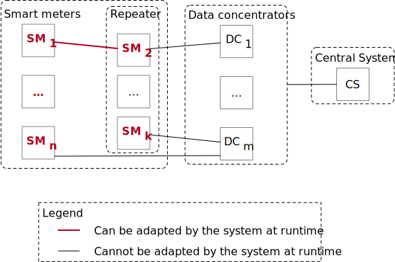

### Smart grid at Luxembourg

This use case has been inspired by the Luxembourgish smart grid description made by Hartmann et al., [Hartmann et al., 2014].
In Luxembourg, smart grid data are generated by smart meters put at customer place.
They send data to a data concentrator which forward them to a central system.
The data concentrators manage a sub-part of the network: detection of failure, querying data.

Adaptation objectives:

- avoid famine
- avoid glutton customer
- avoid overloading on cables
- avoid loss of production

For this use case, the system has to combine consumption data to extract information differently at different levels: cable load, district consumption, country consumption.
The uncertainty should also be propagated to the different compute made.
The following picture depicted two different combinations from the same set of initial data.

