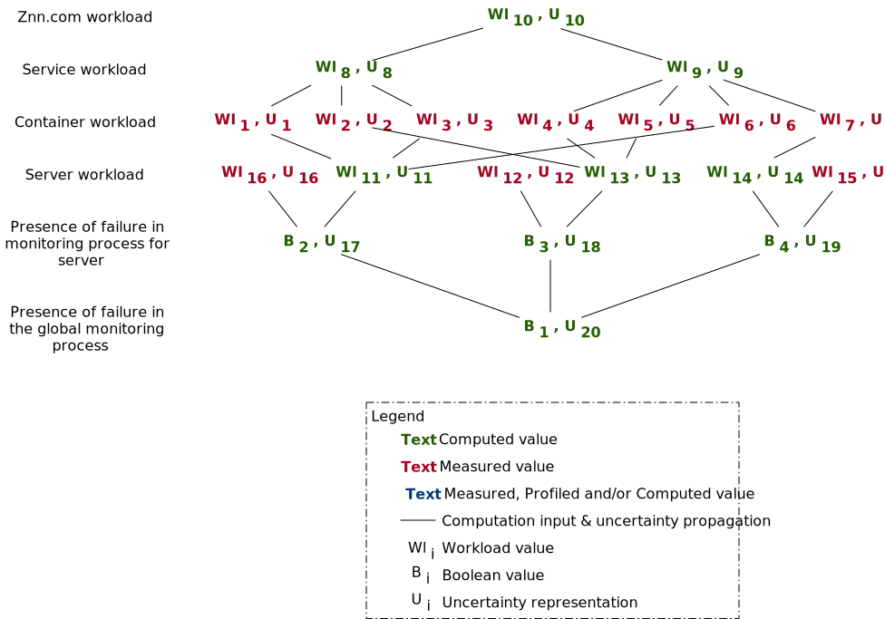

### Cloud infrastructure: Znn.com example

Znn.com is a simplified news system presented by Cheng et al., [Cheng, S. W. et al., 2009].
A full description can also be found on [self-adaptive.org](https://www.hpi.uni-potsdam.de/giese/public/selfadapt/exemplars/model-problem-znn-com/).
By analyzing servers work load, the system should adapt the number of servers and the quality of the news sent to clients (only text, low-quality pictures, low-quality videos, etc.).

We extend this exemplar with containers and services. The Znn.com can be split in different business services (one for blogs, one for videos, one for press back, one for short news, etc.). Containers will be deployed on the different servers. The number of instances all well as their distribution can be adapted at runtime.

Adaptation objectives:

- workload (CPU, bandwidth, memory, etc.) should be equally distributed over the servers
- no running server should be unused
- there is at least 1 container per service
- response time for text should be inferior to 100 ms
- response time for images should be less than 1s
- response time for videos should be less than 1s
- images and video quality should be at the highest possible

To perform the adaptation process, the system should analyze the workload at different levels: container, service and server level.
However, only servers and containers can produce and send workload data.
The system will have to combine them as well as their uncertainty.
On the following figure, we show a tree of how they can be combined.

