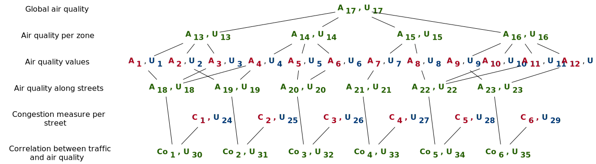

### Smart City

"The smart city can be defined as the integration of data and digital technologies into a strategic approach to sustainability, citizen well-being and economic development." [Scottish Cities Alliance](https://www.scottishcities.org.uk/site/assets/files/1103/smart_cities_readiness_assessment_-_guidance_note.pdf)
In smart city vision, cities will be/are equipped with hundreds of sensors to measure different values.
Based on these values, they can decide to adapt the city environment.
Contrary to the other use cases, here reconfigurations of the city can take several hours even months or years.
For example, to improve air quality, the city hall can decide to forbid most polluting cars in certain districts for certain periods, increase the number of green parks, build new roads to avoid congestion, etc.

Adaptation objectives:

- maximize air quality
- reduce transport time in city centers
- optimize quality of infrastructure

For this use case, the system has to combine consumption data to extract information differently at different levels: cable load, district consumption, country consumption.
The uncertainty should also be propagated to the different compute made.
The following picture depicted two different combinations from the same set of initial data.

